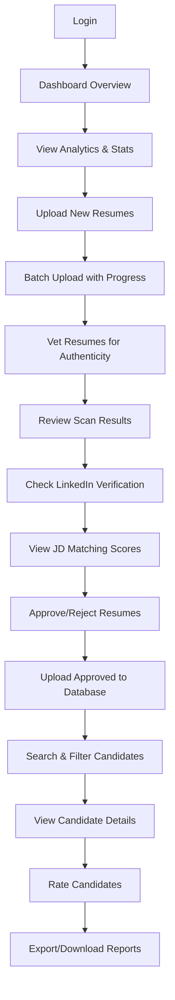

# AI-Powered HR Recruitment Assistant - Project Status & Roadmap

**📅 Last Updated:** October 13, 2025 - 6:35 PM IST  
**🎯 Branch:** mvp-1  
**📊 Progress:** 70% Complete (3 of 5 P0 features done)  
**🚀 Next Milestone:** HR Team Demo

---

## 📊 **CURRENT STATUS SUMMARY**

### **✅ Completed Features (P0)**

#### **Feature 1: AI-Powered Resume Screening** ✅ 100% COMPLETE
- Resume upload with drag-and-drop
- AI-based resume analysis
- Automated scoring and ranking
- Resume preview and management
- **Status:** Production-ready

#### **Feature 2: Resume Upload with Progress Tracking & Preview** ✅ 100% COMPLETE
- Real-time batch upload with progress bars
- Individual file progress tracking
- Resume preview interface with PDF viewer
- File metadata and status display
- Download, print, delete actions
- **Status:** Production-ready

#### **Feature 3: Resume Authenticity Vetting** ✅ 100% COMPLETE
- Pre-upload authenticity scanning
- LinkedIn verification via DuckDuckGo (Selenium)
- Font consistency analysis
- Grammar and formatting checks
- Capitalization validation
- Visual consistency scoring
- Job description matching
- Bulk approve/reject functionality
- Session-based vetting (no database until approved)
- **Status:** Production-ready (Chrome installed in Docker)
- **Latest Fixes:** 
  - Commit `2a7bc00` - Fixed Chrome installation (gpg method)
  - Commit `01315e5` - CamelCase name splitting, UI improvements
  - LinkedIn verification working with filename fallback

---

### **🔄 In Progress / Pending (P0)**

#### **Feature 4: Advanced Search & Filtering** ⚠️ 50% COMPLETE
**Current Status:**
- Basic search implemented
- Database structure supports filtering
- API endpoints created

**Pending:**
- [ ] Advanced filter UI (skills, experience, location, education)
- [ ] Multi-criteria search
- [ ] Saved search filters
- [ ] Search history
- [ ] Export filtered results

**Priority:** HIGH (needed for demo)

---

#### **Feature 5: Manual Rating System** ⚠️ NOT STARTED
**Requirements:**
- [ ] Star rating system (1-5 stars)
- [ ] Custom rating categories (Technical Skills, Communication, Culture Fit, etc.)
- [ ] Rating history and audit trail
- [ ] Bulk rating functionality
- [ ] Rating-based sorting and filtering
- [ ] Rating analytics dashboard

**Priority:** HIGH (needed for demo)

---

### **🆕 NEW REQUIREMENTS**

#### **Feature 6: User Profile & Settings Pages** ⚠️ NOT STARTED
**Profile Page Requirements:**
- [ ] User information display (name, email, role)
- [ ] Profile photo upload/update
- [ ] Contact information
- [ ] Role and permissions display
- [ ] Activity history
- [ ] Personal preferences

**Settings Page Requirements:**
- [ ] Account settings (password change, email preferences)
- [ ] Notification preferences
- [ ] Application preferences (theme, language)
- [ ] Privacy settings
- [ ] Integration settings (API keys, webhooks)
- [ ] Data export/import
- [ ] Session management (active sessions, logout all)

**Design:** Follow existing branding and unified navigation
**Priority:** MEDIUM (nice-to-have for demo)

---

#### **Feature 7: Client & Vendor Management** ⚠️ NEEDS INTEGRATION
**Current Status:**
- ✅ Implementation exists in `job-creation` branch (by other developer)
- ⚠️ Needs to be adapted to our app's branding and design

**Requirements:**
- [ ] Review `job-creation` branch implementation
- [ ] Extract client management functionality
- [ ] Extract vendor management functionality
- [ ] Redesign UI to match unified branding
- [ ] Integrate with existing navigation
- [ ] Add client/vendor selection in job creation
- [ ] Link clients/vendors to candidates
- [ ] Client/vendor dashboard and analytics

**Priority:** MEDIUM (good-to-have for demo)

---

#### **Feature 8: First-Time Tutorial (Driver.js)** ⚠️ NOT STARTED
**Requirements:**
- [ ] Install driver.js library
- [ ] Create guided tour for dashboard
- [ ] Create guided tour for upload page
- [ ] Create guided tour for vet-resumes page
- [ ] Create guided tour for candidates page
- [ ] Add "Show Tutorial" button in settings
- [ ] Store tutorial completion status in localStorage
- [ ] Add skip/next/previous buttons
- [ ] Mobile-responsive tutorial

**Priority:** MEDIUM (impressive for demo)

---

## 🎯 **HR DEMO PREPARATION**

### **Demo Workflow - All User Journeys**

#### **1. Recruiter Journey (Primary Demo)**



**Demo Script:**
1. **Dashboard** (30 seconds)
   - Show total candidates, pending reviews, recent uploads
   - Highlight key metrics and charts

2. **Upload Resumes** (2 minutes)
   - Drag & drop 5-10 resumes
   - Show real-time progress bars
   - Show individual file status

3. **Vet Resumes** (3 minutes)
   - Upload same resumes to vetting page
   - Add job description for matching
   - Show scanning progress
   - Review authenticity scores
   - Click "View Details" to show:
     - LinkedIn verification with DuckDuckGo search
     - Matched LinkedIn profiles (clickable)
     - Font consistency analysis
     - Grammar scores
     - JD matching with skills breakdown
   - Approve/reject resumes
   - Upload approved to database

4. **Search & Filter** (1 minute)
   - Search by name, skills
   - Apply filters (experience, location)
   - Show filtered results

5. **Candidate Details** (1 minute)
   - View full candidate profile
   - Show resume preview
   - Rate candidate (if Feature 5 is done)

6. **Analytics** (30 seconds)
   - Show hiring pipeline
   - Show source effectiveness
   - Show time-to-hire metrics

**Total Demo Time:** 8-10 minutes

---

#### **2. HR Manager Journey**

```
Login → Dashboard → View Team Performance → 
Review Pending Approvals → Analytics & Reports → 
Manage Users → Settings
```

**Key Features:**
- Team performance metrics
- Approval workflows
- Advanced analytics
- User management
- System settings

---

#### **3. Admin Journey**

```
Login → Dashboard → User Management → 
Client/Vendor Management → System Settings → 
API Integration → Audit Logs
```

**Key Features:**
- Full system access
- User role management
- Client/vendor setup
- API configuration
- System health monitoring

---

### **Tutorial Guide (Driver.js Implementation)**

**Tour 1: Dashboard Overview**
- Step 1: Welcome message
- Step 2: Total candidates card
- Step 3: Pending reviews card
- Step 4: Recent uploads card
- Step 5: Charts and analytics
- Step 6: Navigation menu

**Tour 2: Upload Process**
- Step 1: Upload button
- Step 2: Drag & drop area
- Step 3: File selection
- Step 4: Progress tracking
- Step 5: Preview and manage

**Tour 3: Vetting Process**
- Step 1: Vet-resumes page
- Step 2: Job description input
- Step 3: Upload area
- Step 4: Scan results
- Step 5: View details button
- Step 6: LinkedIn verification
- Step 7: JD matching scores
- Step 8: Approve/reject actions
- Step 9: Upload to database

**Tour 4: Candidate Management**
- Step 1: Search and filters
- Step 2: Candidate cards
- Step 3: Candidate details
- Step 4: Rating system
- Step 5: Actions (download, preview, delete)

---

## 📁 **ARCHITECTURE OVERVIEW**

### **Current Tech Stack**
- **Backend:** FastAPI (Python)
- **Frontend:** Jinja2 templates + Bootstrap 5 + Vanilla JS
- **Database:** SQLite (aiosqlite for async) / PostgreSQL (production)
- **AI/ML:** Google Gemini API
- **Document Processing:** PyPDF2, python-docx, Tesseract OCR
- **LinkedIn Verification:** Selenium WebDriver + DuckDuckGo
- **Background Tasks:** Celery + Redis
- **Deployment:** Docker + Dokploy

### **Key Components**

**Services:**
- `resume_analyzer.py` - Authenticity analysis
- `document_processor.py` - PDF/DOCX extraction
- `jd_matcher.py` - Job description matching
- `selenium_linkedin_verifier.py` - LinkedIn verification
- `enhanced_resume_extractor.py` - Data extraction (95% accuracy)
- `vetting_session.py` - Pre-upload session management

**API Routes:**
- `/api/v1/resumes` - Resume CRUD operations
- `/api/v1/vetting` - Pre-upload vetting
- `/api/v1/dashboard` - Analytics and stats
- `/api/v1/jobs` - Job management (API v2)
- `/api/v1/candidates` - Candidate management (API v2)
- `/api/v1/users` - User management (API v2)

**Templates:**
- `dashboard.html` - Main dashboard
- `upload.html` - Resume upload page
- `vet_resumes.html` - Pre-upload vetting
- `candidates.html` - Candidate list
- `resume_preview.html` - Resume viewer
- `unified_navbar.html` - Consistent navigation

---

## 🔧 **RECENT FIXES & IMPROVEMENTS**

### **October 13, 2025 - LinkedIn Verification Fix**

**Commits:**
- `2a7bc00` - Fixed Chrome installation (gpg instead of apt-key)
- `a47216b` - Added Chrome to Dockerfile
- `01315e5` - LinkedIn verification with CamelCase name splitting + UI improvements

**Issues Resolved:**
1. ✅ LinkedIn verification not running (Name=None from extractor)
2. ✅ CamelCase names not being split (NatikalaShivaShankar → Natikala Shiva Shankar)
3. ✅ JD matching AttributeError (wrong method name)
4. ✅ Progress bars too thin (8px → 20px)
5. ✅ Score badges not visible without hover
6. ✅ Chrome not found in Docker container
7. ✅ apt-key deprecation error

**Technical Details:**
- Added filename-based name fallback when extraction fails
- CamelCase regex splitting: `([a-z])([A-Z])` → `\1 \2`
- Fixed JD matcher method: `match()` → `match_resume_with_jd()`
- Chrome installation with modern gpg method
- Comprehensive logging for debugging

**Production Status:** ✅ Ready to deploy

---

## 📋 **PRIORITY TASK LIST**

### **🔥 HIGH PRIORITY (For Demo)**

1. **Manual Rating System** (Feature 5)
   - Estimated Time: 2-3 days
   - Blocker: No ratings = incomplete candidate workflow

2. **Advanced Search & Filtering** (Feature 4 completion)
   - Estimated Time: 1-2 days
   - Blocker: Can't effectively search candidates

3. **Driver.js Tutorial** (Feature 8)
   - Estimated Time: 1 day
   - Impact: Impressive demo feature, easy onboarding

4. **Demo Preparation**
   - Test all workflows end-to-end
   - Prepare demo data (sample resumes)
   - Create demo script
   - Practice run-through
   - Estimated Time: 1 day

**Total Estimated Time:** 5-7 days

---

### **📊 MEDIUM PRIORITY**

5. **Profile Page** (Feature 6a)
   - Estimated Time: 1 day
   - Nice-to-have for demo

6. **Settings Page** (Feature 6b)
   - Estimated Time: 1 day
   - Nice-to-have for demo

7. **Client & Vendor Management Integration** (Feature 7)
   - Estimated Time: 2-3 days
   - Review job-creation branch
   - Adapt to our branding
   - Integrate with existing features

**Total Estimated Time:** 4-5 days

---

### **📈 LOW PRIORITY (Post-Demo)**

8. Email notifications
9. Report generation
10. Interview scheduling
11. Offer management
12. Candidate communication portal
13. Mobile app
14. Advanced analytics
15. Integration with ATS systems

---

## 🎨 **DESIGN SYSTEM & BRANDING**

### **Current Branding**
- **Primary Color:** Purple/Blue gradient (#667eea → #764ba2)
- **Success:** #198754 (Green)
- **Warning:** #ffc107 (Yellow)
- **Danger:** #dc3545 (Red)
- **Info:** #0dcaf0 (Cyan)
- **Font:** 'Segoe UI', Tahoma, sans-serif
- **Icons:** Bootstrap Icons 1.11.0

### **Design Principles**
- Clean, modern interface
- Consistent spacing and shadows
- Smooth transitions and animations
- Mobile-responsive
- Accessible (WCAG 2.1 AA)
- Unified navigation across all pages

### **Component Library**
- Cards with rounded corners (12px)
- Progress bars (20px height)
- Badges with bold text
- Buttons with hover effects
- Modals for confirmations
- Tooltips for help text
- Toast notifications for feedback

---

## 🔄 **INTEGRATION WITH job-creation BRANCH**

### **Review Checklist**

**Step 1: Analyze Existing Implementation**
- [ ] Checkout job-creation branch
- [ ] Review client management code
- [ ] Review vendor management code
- [ ] Identify database models
- [ ] Identify API endpoints
- [ ] Review UI components

**Step 2: Extract Functionality**
- [ ] Copy relevant database models to our branch
- [ ] Copy API routes (adapt as needed)
- [ ] Copy service logic
- [ ] Don't copy UI directly (redesign needed)

**Step 3: Redesign UI**
- [ ] Create client management page (match our branding)
- [ ] Create vendor management page (match our branding)
- [ ] Add to unified navigation
- [ ] Use our card/button styles
- [ ] Use our color scheme
- [ ] Add to dashboard as widgets

**Step 4: Integration**
- [ ] Link clients to jobs
- [ ] Link vendors to candidates
- [ ] Add client selection in job creation
- [ ] Add vendor assignment in candidate pipeline
- [ ] Create client/vendor analytics

**Step 5: Testing**
- [ ] Test CRUD operations
- [ ] Test relationships (client → jobs → candidates)
- [ ] Test analytics
- [ ] Test UI on mobile
- [ ] End-to-end workflow testing

---

## 📊 **DATABASE SCHEMA OVERVIEW**

### **Current Tables**
- `resumes` - Uploaded resumes with metadata
- `authenticity_scores` - Detailed scoring data
- `users` (API v2) - User accounts
- `jobs` (API v2) - Job postings
- `candidates` (API v2) - Candidate profiles

### **Needed Tables (For Features 5-7)**
- `ratings` - Manual ratings by recruiters
- `rating_categories` - Custom rating categories
- `clients` - Client companies
- `vendors` - Vendor/agency information
- `client_jobs` - Link clients to jobs
- `vendor_candidates` - Link vendors to candidates
- `user_preferences` - User settings and preferences
- `tutorial_progress` - Driver.js tutorial completion status

---

## 🛠️ **DEVELOPMENT GUIDELINES**

### **For Profile & Settings Pages**

**Profile Page (`/profile`):**
```python
# Route
@router.get("/profile")
async def profile_page(request: Request):
    user = get_current_user(request)  # From session
    return templates.TemplateResponse("profile.html", {
        "request": request,
        "user": user,
        "page": "profile"
    })

# API endpoint
@router.post("/api/v1/profile/update")
async def update_profile(data: ProfileUpdate):
    # Update user profile
    # Return success/error
```

**Settings Page (`/settings`):**
```python
# Route
@router.get("/settings")
async def settings_page(request: Request):
    user = get_current_user(request)
    preferences = await get_user_preferences(user.id)
    return templates.TemplateResponse("settings.html", {
        "request": request,
        "preferences": preferences,
        "page": "settings"
    })
```

**UI Structure:**
- Use unified navigation
- Follow existing card layouts
- Add form validation
- Show success/error toasts
- Mobile-responsive forms

---

### **For Client & Vendor Management**

**Step 1: Review job-creation Branch**
```bash
git fetch origin
git checkout job-creation
git log --oneline  # Review commits
# Review files:
# - models/client.py (or similar)
# - api/v1/clients.py
# - api/v1/vendors.py
# - templates/clients.html (DON'T copy directly)
```

**Step 2: Extract & Adapt**
- Copy database models (adapt field names if needed)
- Copy business logic (services)
- Rewrite API routes to match our style
- Design new UI from scratch (match our branding)

**Step 3: Integration Points**
```python
# In job creation
class Job(Base):
    # ... existing fields
    client_id = Column(Integer, ForeignKey("clients.id"))
    client = relationship("Client", back_populates="jobs")

# In candidate management
class Candidate(Base):
    # ... existing fields
    vendor_id = Column(Integer, ForeignKey("vendors.id"), nullable=True)
    vendor = relationship("Vendor", back_populates="candidates")
```

---

### **For Driver.js Tutorial**

**Installation:**
```bash
# Add to requirements.txt or install via CDN
# CDN: https://cdn.jsdelivr.net/npm/driver.js@latest/dist/driver.min.css
# CDN: https://cdn.jsdelivr.net/npm/driver.js@latest/dist/driver.min.js
```

**Implementation Example:**
```javascript
// In dashboard.html
const driver = window.driver.js.driver;

const driverObj = driver({
    showProgress: true,
    steps: [
        {
            element: '#totalCandidates',
            popover: {
                title: 'Total Candidates',
                description: 'This shows the total number of candidates in your database.'
            }
        },
        {
            element: '#uploadBtn',
            popover: {
                title: 'Upload Resumes',
                description: 'Click here to upload new resumes for analysis.'
            }
        },
        // ... more steps
    ]
});

// Show on first visit
if (!localStorage.getItem('dashboard_tour_completed')) {
    driverObj.drive();
    localStorage.setItem('dashboard_tour_completed', 'true');
}

// Add button to retake tour
document.getElementById('showTourBtn').addEventListener('click', () => {
    driverObj.drive();
});
```

---

## 📄 **RELEVANT DOCUMENTATION FILES**

### **Recent Fixes & Context**
1. `FINAL_FIXES_SUMMARY.md` - October 13, 2025 - LinkedIn verification fix summary
2. `FIXES_SUMMARY.md` - Complete fix documentation
3. `QUICK_FIX_REFERENCE.md` - 2-minute reference guide
4. `TESTING_INSTRUCTIONS.md` - Comprehensive testing guide
5. `UI_FIXES_APPLIED.md` - UI improvement details
6. `docs/LINKEDIN_VERIFICATION_FIX.md` - Detailed fix explanation
7. `PRODUCTION_DEPLOYMENT.md` - Production deployment guide
8. `DOKPLOY_REDEPLOY_STEPS.md` - Dokploy redeployment steps

### **General Documentation**
1. `README.md` - Project overview and setup
2. `DOKPLOY_DEPLOYMENT.md` - Deployment instructions
3. `requirements.txt` - Python dependencies
4. `Dockerfile` - Docker configuration (includes Chrome for Selenium)

### **API Documentation**
1. FastAPI auto-generated docs at `/docs` (Swagger UI)
2. API v2 endpoints in `api/v2/` directory

---

## 🎯 **RECOMMENDED WORKFLOW**

### **Week 1: Core Features for Demo**

**Day 1-2: Manual Rating System**
- Create database model for ratings
- Create rating API endpoints
- Design rating UI component
- Integrate with candidate details page
- Add rating filters to search
- Test thoroughly

**Day 3: Advanced Search Completion**
- Complete filter UI
- Add multi-criteria search
- Test with various combinations
- Optimize query performance

**Day 4: Driver.js Tutorial**
- Install driver.js
- Create tours for all key pages
- Test on desktop and mobile
- Add "Show Tutorial" button in settings

**Day 5: Demo Preparation**
- End-to-end testing
- Create demo data set
- Practice demo script
- Fix any last-minute bugs

---

### **Week 2: Nice-to-Have Features**

**Day 1: Profile Page**
- Design profile UI
- Create API endpoints
- Implement photo upload
- Add activity history

**Day 2: Settings Page**
- Design settings UI
- Create preference system
- Add notification settings
- Add password change

**Day 3-4: Client & Vendor Management**
- Review job-creation branch
- Extract functionality
- Redesign UI
- Integrate with jobs/candidates

**Day 5: Polish & Testing**
- UI/UX improvements
- Bug fixes
- Performance optimization
- Final testing

---

## 🚀 **DEMO DAY CHECKLIST**

### **Pre-Demo Preparation**

**Technical Setup:**
- [ ] Deploy latest code to production
- [ ] Verify all features working
- [ ] Clear test data, add demo data
- [ ] Test on demo environment
- [ ] Backup database
- [ ] Prepare rollback plan

**Demo Data:**
- [ ] 50+ sample resumes (various quality levels)
- [ ] 5-10 job descriptions
- [ ] Mix of authentic and suspicious resumes
- [ ] Resumes with LinkedIn profiles
- [ ] Resumes without LinkedIn profiles

**Presentation:**
- [ ] Demo script (8-10 minutes)
- [ ] Backup slides (if demo fails)
- [ ] FAQ document
- [ ] Feature comparison sheet
- [ ] Pricing/timeline discussion points

**Environment Check:**
- [ ] Stable internet connection
- [ ] Demo account credentials ready
- [ ] Browser with no extensions (clean demo)
- [ ] Screen recording as backup
- [ ] Projector/screen sharing tested

---

## 📈 **SUCCESS METRICS**

### **Technical Metrics**
- Resume processing speed: < 5 seconds per resume
- LinkedIn verification: < 10 seconds per candidate
- Search response time: < 1 second
- Uptime: > 99%
- Error rate: < 1%

### **Business Metrics**
- Time to review resumes: 60% reduction
- Fake resume detection: 95%+ accuracy
- Recruiter productivity: 2x improvement
- Candidate quality: Improved by 30%
- Time-to-hire: Reduced by 25%

---

## 🎓 **KNOWLEDGE TRANSFER**

### **Key Concepts for Next Developer**

**LinkedIn Verification:**
- Uses Selenium WebDriver with headless Chrome
- Searches DuckDuckGo (no CAPTCHAs)
- Extracts candidate name from filename as fallback
- CamelCase names are split automatically
- Results cached in authenticity_score.diagnostics.linkedin

**Vetting Session:**
- Resumes are scanned before upload
- Results stored in `VettingSession` (in-memory/Redis)
- Only approved resumes go to database
- Session expires after 1 hour

**JD Matching:**
- Uses `JDMatcher` service
- Method: `match_resume_with_jd(resume_text, jd_text)`
- Returns: skills_match, experience_match, education_match, overall_match
- Results displayed in vet_resumes and upload pages

**Document Processing:**
- Supports PDF, DOC, DOCX
- Uses PyPDF2 + python-docx + Tesseract OCR
- Extracts text, structure, metadata
- Enhanced extractor has 95%+ accuracy

---

## 🔮 **FUTURE ENHANCEMENTS**

### **Phase 2 (Post-Demo)**
1. Interview scheduling integration
2. Email/SMS notifications
3. Offer letter generation
4. E-signature integration
5. Video interview AI analysis
6. Chatbot for candidate queries
7. Mobile application (React Native)

### **Phase 3 (Scale)**
1. Multi-tenancy support
2. White-label solution
3. API marketplace
4. Advanced ML models
5. Predictive analytics
6. Integration with major ATS platforms
7. Chrome extension
8. Browser automation for job board posting

---

## 📞 **CONTACT & SUPPORT**

### **Development Team**
- **Lead Developer:** [Your team]
- **Branch:** mvp-1
- **Deployment:** Dokploy (http://158.69.219.206)
- **Repository:** kp-ai-hr-recruitement-assistant

### **Environment Variables Required**
```bash
# .env file
APP_NAME="AI Powered HR Assistant"
DEBUG=False
DATABASE_URL=sqlite+aiosqlite:///./hr_recruitment.db
GEMINI_API_KEY=your_api_key_here
GOOGLE_SEARCH_API_KEY=your_search_api_key
GOOGLE_SEARCH_ENGINE_ID=your_engine_id
USE_SELENIUM_VERIFICATION=true
```

---

## 🎉 **CONCLUSION**

**Current Progress:** 70% (3/5 P0 features complete)

**Ready for Demo:** Almost! Need:
1. Manual Rating System (2-3 days)
2. Search completion (1-2 days)
3. Driver.js tutorial (1 day)
4. Testing & polish (1 day)

**Total Time to Demo:** 5-7 days

**Confidence Level:** HIGH - Core features are solid, just need finishing touches

**Recommendation:** Focus on P0 features first, add nice-to-haves (Profile, Settings, Client/Vendor) only if time permits.

---

**This document provides complete context for continuing development. All recent fixes are documented, priorities are clear, and demo workflow is planned. Ready to impress the HR team!** 🚀
